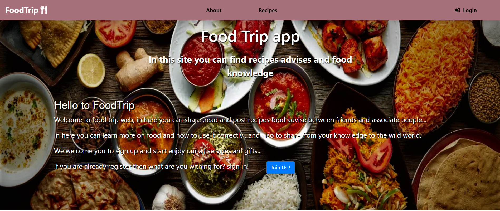
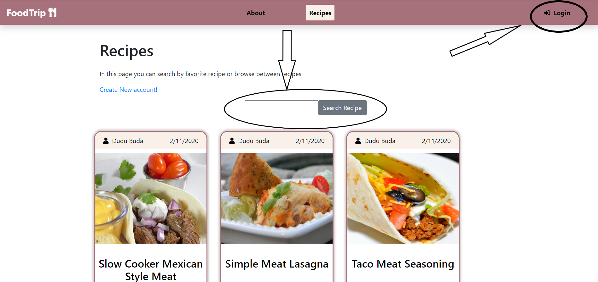
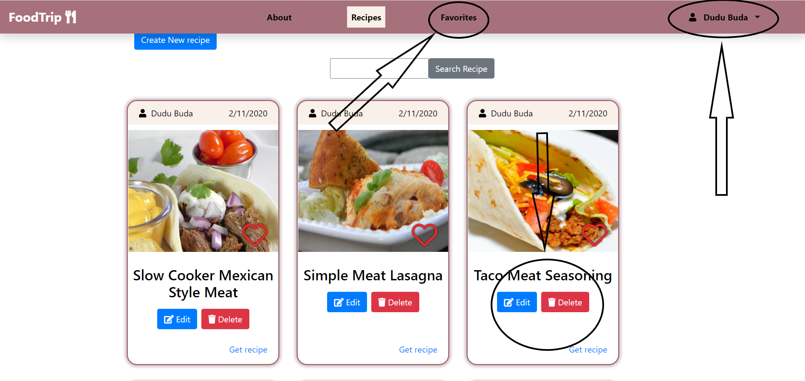
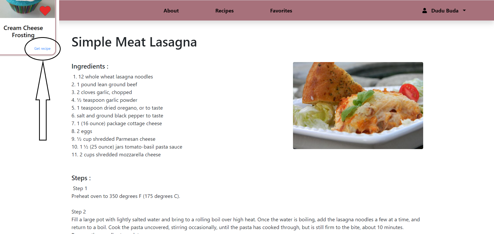
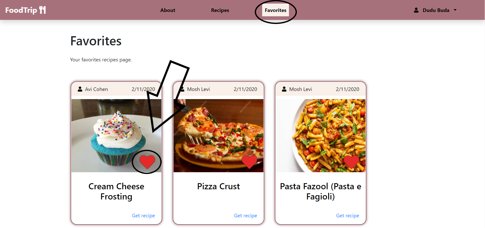
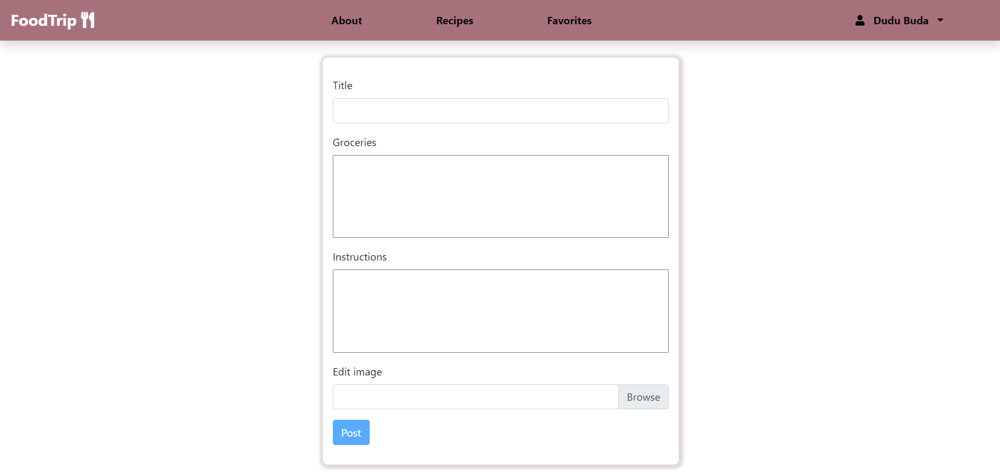
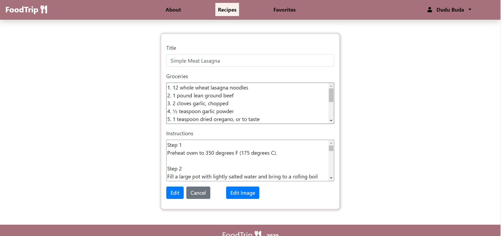
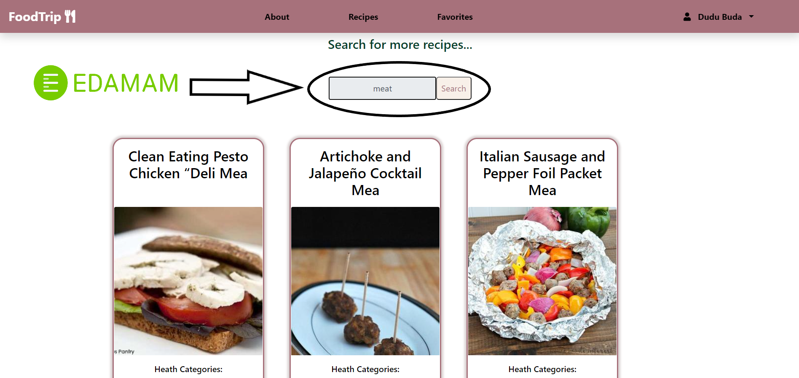

# FoodTrip 

## Tech


* [React]() - JavaScript library for building user interfaces!
  * [axios]() - Promise based HTTP client for the browser and node.js.
  * [joi-browser]() - Object schema validation bundled for the browser.
  * [bootstrap]() - Design and customize responsive sites.
  * [jwt-decode]() - Allows you to decode, verify and generate JWT.
  * [react-router-dom]() - DOM binding for React Router.
  * [react-dom]() - Serves as the entry point to the DOM and server renderers for React.
* [node.js]() - Build scalable network applications backend.
  * [mongoose]() - MongoDB connection and object modeling toolx.
  * [nodemon]() - Automatically restarting the node application when file changes.
  * [Express]() - Web application framework for Node.js.
  * [express-fileupload]() - Simple express middleware for uploading files.
  * [@hapi/joi]() - Schema description language and data validator.
  * [bcrypt]() - Library to help you hash passwords.
  * [jsonwebtoken]() - Implementation of JSON Web Tokens.
* [MongoDB]() - Document-based distributed database. 

## Web Flow And Features

### Main page.



### Unregistered user can enjoy recipes and search recipe by name or ingredients.



### When register few options are opening to the user favorites ,get recipe ,create ,edit and delete.



### When press the get recipe button the user go to recipe page.



### The user can add and remove from favorites by press the hart-favorite icon.



### The user can create a new recipe with image file upload.



### The user can edit the recipe and choose if he want to edit image.



### The user can search for recipe and connect to Edamam API and can get the recipe by pressing at card-link button.



## Installation

#### Front-End:

FoodTrip required [React] V16.0.3 to run.
Runs on PORT 3000.

```sh
$ npm install
```
**or:**
```sh
$ yarn install
```

#### Back-End:

FoodTrip required [Node.js] V12.18.03 to run.
Runs on PORT 4000 (for changing you need to set in the back and the front).

```sh
$ npm install
```
**or:**
```sh
$ yarn install
```

## Activated 

#### Front-End:

```sh
$ npm start
```
**or:**
```sh
$ yarn start
```

#### Back-End:

* run in nodemon.

```sh
$ npm run dev
```
**or:**
```sh
$ yarn run dev
```

* **run without nodemon.**

```sh
$ npm run start
```
**or:**
```sh
$ yarn run start
```


